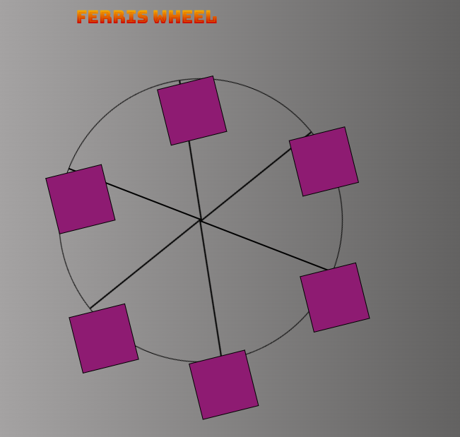

# Rotating Ferris Wheel Project

This project showcases a Ferris Wheel with rotating elements using HTML and CSS animations.

## Preview



## Getting Started

1. Clone the repository:

   ```bash
   git@github.com:oussama2505/CSS_Transforms_Ferris_Wheel.git

2. Open index.html in your preferred web browser to view the rotating Ferris Wheel.
Customization
Feel free to customize the rotating Ferris Wheel further. You can modify the styles.css file to change colors, dimensions, or adjust animation properties such as duration and timing functions.

Animation Details
The Ferris Wheel is animated with CSS keyframes. The entire wheel rotates from 0 to 360 degrees, while the cabins rotate in the opposite direction from 0 to -360 degrees, creating a continuous and dynamic effect.


```bash
@keyframes wheel {
    0%{
        transform: rotate(0deg);
    }
    100%{
        transform: rotate(360deg);
    }
}

    @keyframes cabins {
        0%{
            transform: rotate(0deg);
            
        }
        25%{
            background-color: yellow;
        }
        50%{
            background-color: purple;
        }
        75%{
            background-color: yellow;
        }
        100%{
            transform: rotate(-360deg);
        }
    }

.ferris-wheel {
  animation: rotateWheel 5s linear infinite; /* Adjust the duration and timing function as needed */
}

.wheel {
  animation: rotateCabins 5s linear infinite reverse; /* Adjust the duration and timing function as needed */
}

.cabin{
    background-color: red;
    width: 20%;
    height: 20%;
    position: absolute;
    border: 2px solid;
    transform-origin: 50% 0%;
    animation: cabins 10s ease-in-out infinite;
}

.wheel{
    margin-top: 150px;
    border: 2px solid black;
    border-radius: 50%;
    margin-left: 100px;
    position: absolute;
    width: 55vw;
    height: 55vw;
    max-width: 500px;
    max-height: 500px;
    animation-name: wheel;
    animation-duration: 10s;
    animation-iteration-count: infinite;
    animation-timing-function: linear;
}


Author
OUSSAMA
